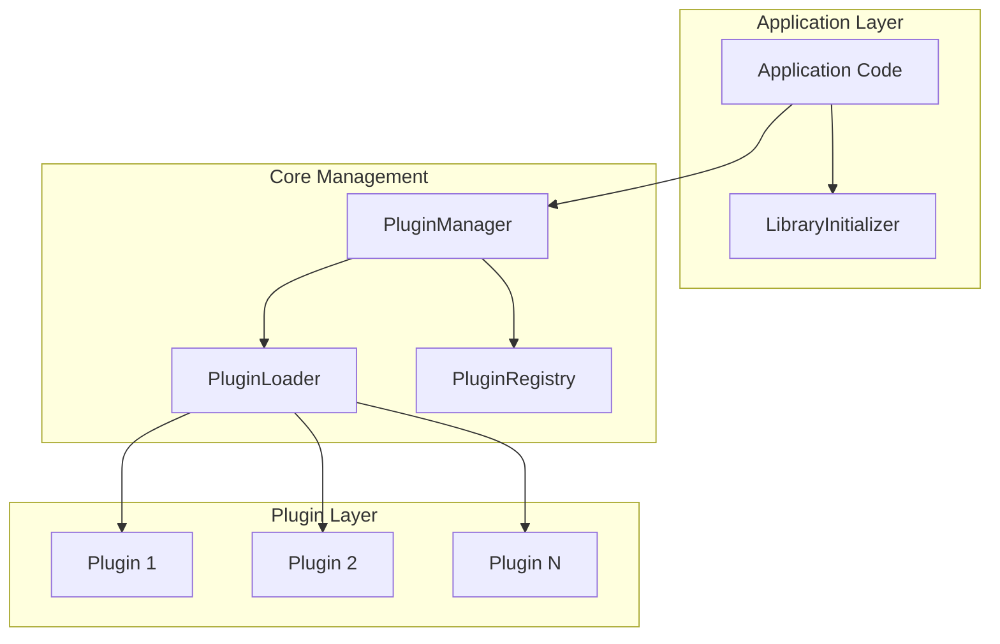

# Core Classes

The QtPlugin core module provides essential classes for plugin management, loading, and system orchestration.

## Overview

The core classes work together to provide a complete plugin management system:



## Essential Classes

### [PluginManager](pluginmanager.md) - Central Plugin Orchestration

The `PluginManager` is the primary interface for all plugin operations.

**Header**: `qtplugin/core/plugin_manager.hpp`

**Key Responsibilities:**

- Plugin discovery and loading
- Lifecycle management
- Dependency resolution
- State monitoring
- Security enforcement

**Basic Usage:**

```cpp
#include <qtplugin/qtplugin.hpp>

qtplugin::PluginManager manager;

// Load a plugin
auto result = manager.load_plugin("./plugins/example.qtplugin");
if (result) {
    auto plugin = manager.get_plugin(result.value());
    plugin->initialize();
}
```

**Key Methods:**

| Method | Purpose | Return Type |
|--------|---------|-------------|
| `load_plugin()` | Load a plugin from file | `expected<string, PluginError>` |
| `unload_plugin()` | Unload a loaded plugin | `expected<void, PluginError>` |
| `get_plugin()` | Get plugin by ID | `shared_ptr<IPlugin>` |
| `discover_plugins()` | Find plugins in directories | `vector<filesystem::path>` |
| `get_plugins_by_capability()` | Filter plugins by capability | `vector<shared_ptr<IPlugin>>` |

### [PluginLoader](pluginloader.md) - Low-Level Plugin Loading

The `PluginLoader` handles the mechanics of loading dynamic libraries.

**Header**: `qtplugin/core/plugin_loader.hpp`

**Key Responsibilities:**

- Dynamic library loading/unloading
- Symbol resolution
- Interface validation
- Memory management

**Implementation Classes:**

- `QtPluginLoader` - Default Qt-based loader
- `PlatformPluginLoader` - Platform-specific optimizations

**Example:**

```cpp
qtplugin::QtPluginLoader loader;

if (loader.can_load("./plugins/example.qtplugin")) {
    auto result = loader.load("./plugins/example.qtplugin");
    if (result) {
        auto plugin = result.value();
        // Use plugin...
    }
}
```

### [LibraryInitializer](libraryinitializer.md) - RAII Library Setup

The `LibraryInitializer` provides automatic library initialization and cleanup.

**Header**: `qtplugin/qtplugin.hpp`

**Key Features:**

- RAII-based initialization
- Automatic cleanup
- Thread-safe initialization
- Error reporting

**Usage:**

```cpp
int main() {
    qtplugin::LibraryInitializer init;
    if (!init.is_initialized()) {
        std::cerr << "Failed to initialize QtPlugin" << std::endl;
        return -1;
    }
    
    // Use QtPlugin...
    
    return 0; // Automatic cleanup
}
```

## Plugin Management Workflow

### 1. Library Initialization

```cpp
// Initialize the library
qtplugin::LibraryInitializer init;
if (!init.is_initialized()) {
    // Handle initialization failure
    return false;
}
```

### 2. Plugin Manager Creation

```cpp
// Create plugin manager
qtplugin::PluginManager manager;

// Configure search paths
manager.add_search_path("./plugins");
manager.add_search_path("/usr/local/lib/plugins");
```

### 3. Plugin Discovery

```cpp
// Discover available plugins
auto discovered = manager.discover_plugins();
std::cout << "Found " << discovered.size() << " plugins" << std::endl;

for (const auto& path : discovered) {
    std::cout << "Plugin: " << path.filename().string() << std::endl;
}
```

### 4. Plugin Loading

```cpp
// Load plugins with options
qtplugin::PluginLoadOptions options;
options.security_level = qtplugin::SecurityLevel::Verified;
options.validate_signature = true;

for (const auto& path : discovered) {
    auto result = manager.load_plugin(path, options);
    if (result) {
        std::cout << "Loaded: " << result.value() << std::endl;
    } else {
        std::cerr << "Failed to load " << path.filename().string() 
                  << ": " << result.error().message << std::endl;
    }
}
```

### 5. Plugin Usage

```cpp
// Get plugins by capability
auto ui_plugins = manager.get_plugins_by_capability(
    qtplugin::PluginCapability::UI
);

for (auto plugin : ui_plugins) {
    // Initialize plugin
    auto init_result = plugin->initialize();
    if (init_result) {
        // Use plugin functionality
        auto cmd_result = plugin->execute_command("status");
        if (cmd_result) {
            std::cout << "Plugin status: " << cmd_result.value() << std::endl;
        }
    }
}
```

## Configuration Options

### Plugin Load Options

```cpp
struct PluginLoadOptions {
    SecurityLevel security_level = SecurityLevel::Verified;
    bool validate_signature = true;
    bool enable_hot_reload = false;
    std::chrono::milliseconds timeout = std::chrono::seconds(30);
    bool async_initialization = false;
    std::optional<QJsonObject> initial_config = std::nullopt;
};
```

### Manager Configuration

```cpp
// Configure plugin manager
manager.set_security_level(qtplugin::SecurityLevel::Verified);
manager.set_max_concurrent_loads(4);
manager.enable_performance_monitoring(true);
manager.set_plugin_timeout(std::chrono::seconds(30));
```

## Error Handling

### Common Error Codes

```cpp
enum class PluginErrorCode {
    None = 0,
    FileNotFound,           // Plugin file not found
    InvalidFormat,          // Invalid plugin format
    LoadFailed,            // Failed to load library
    InitializationFailed,  // Plugin initialization failed
    SecurityViolation,     // Security validation failed
    DependencyNotFound,    // Required dependency missing
    VersionMismatch,       // Version compatibility issue
    ConfigurationError,    // Configuration validation failed
    CommandNotFound,       // Unknown command
    PermissionDenied,      // Insufficient permissions
    ResourceExhausted,     // Resource limits exceeded
    TimeoutExpired,        // Operation timed out
    AlreadyLoaded,         // Plugin already loaded
    NotLoaded,             // Plugin not loaded
    InternalError          // Internal system error
};
```

### Error Handling Patterns

```cpp
// Check for specific errors
auto result = manager.load_plugin(plugin_path);
if (!result) {
    const auto& error = result.error();
    
    switch (error.code) {
        case qtplugin::PluginErrorCode::FileNotFound:
            std::cerr << "Plugin file not found: " << plugin_path << std::endl;
            break;
            
        case qtplugin::PluginErrorCode::SecurityViolation:
            std::cerr << "Security validation failed: " << error.message << std::endl;
            break;
            
        case qtplugin::PluginErrorCode::DependencyNotFound:
            std::cerr << "Missing dependencies: " << error.message << std::endl;
            break;
            
        default:
            std::cerr << "Plugin load failed: " << error.message << std::endl;
            break;
    }
}
```

## Performance Considerations

### Asynchronous Operations

```cpp
// Asynchronous plugin loading
auto future = manager.load_plugin_async(plugin_path);

// Do other work...

// Get result when ready
auto result = future.get();
if (result) {
    std::cout << "Plugin loaded: " << result.value() << std::endl;
}
```

### Batch Operations

```cpp
// Load multiple plugins efficiently
qtplugin::PluginLoadOptions options;
options.async_initialization = true;

int loaded_count = manager.load_all_plugins(options);
std::cout << "Loaded " << loaded_count << " plugins" << std::endl;
```

### Memory Management

```cpp
// Monitor plugin memory usage
auto plugins = manager.loaded_plugins();
for (const auto& [id, plugin] : plugins) {
    auto memory_usage = plugin->current_memory_usage();
    if (memory_usage && *memory_usage > 100 * 1024 * 1024) { // 100MB
        std::cout << "Plugin " << id << " using " 
                  << (*memory_usage / 1024 / 1024) << "MB" << std::endl;
    }
}
```

## Thread Safety

All core classes are designed to be thread-safe:

```cpp
// Safe to call from multiple threads
std::vector<std::thread> threads;

for (int i = 0; i < 4; ++i) {
    threads.emplace_back([&manager, i]() {
        auto plugin_path = "plugins/plugin" + std::to_string(i) + ".qtplugin";
        auto result = manager.load_plugin(plugin_path);
        // Handle result...
    });
}

for (auto& thread : threads) {
    thread.join();
}
```

## Integration Examples

### Qt Application Integration

```cpp
class MainWindow : public QMainWindow {
    Q_OBJECT

public:
    MainWindow(QWidget* parent = nullptr) : QMainWindow(parent) {
        setupPluginSystem();
        loadPlugins();
    }

private:
    void setupPluginSystem() {
        m_plugin_manager = std::make_unique<qtplugin::PluginManager>();
        m_plugin_manager->add_search_path("./plugins");
        
        // Connect signals
        connect(m_plugin_manager.get(), &qtplugin::PluginManager::plugin_loaded,
                this, &MainWindow::onPluginLoaded);
    }
    
    void loadPlugins() {
        auto discovered = m_plugin_manager->discover_plugins();
        for (const auto& path : discovered) {
            m_plugin_manager->load_plugin(path);
        }
    }

private slots:
    void onPluginLoaded(const QString& plugin_id) {
        auto plugin = m_plugin_manager->get_plugin(plugin_id.toStdString());
        if (plugin) {
            plugin->initialize();
            // Integrate plugin into UI...
        }
    }

private:
    std::unique_ptr<qtplugin::PluginManager> m_plugin_manager;
};
```

## See Also

- **[Plugin Interfaces](../interfaces/index.md)** - Plugin interface documentation
- **[Security API](../security/index.md)** - Security and validation
- **[Utilities](../utilities/index.md)** - Helper classes and functions
- **[Examples](../examples.md)** - Complete usage examples

---

**Next**: [PluginManager](pluginmanager.md) for detailed plugin manager documentation.
