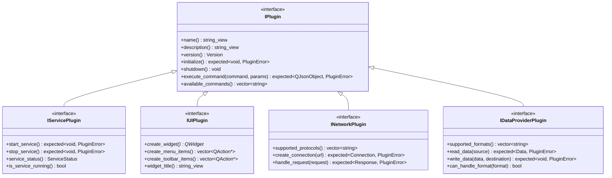

# Plugin Interfaces

QtPlugin provides a comprehensive set of interfaces for different types of plugins. All plugins must implement the base `IPlugin` interface, and can optionally implement specialized interfaces for additional functionality.

## Interface Hierarchy



## Core Interface

### [IPlugin](iplugin.md) - Base Plugin Interface

The fundamental interface that all plugins must implement.

**Key Features:**

- Plugin metadata (name, version, author, etc.)
- Lifecycle management (initialize, shutdown)
- Command execution system
- Configuration support
- Error handling

**Required Methods:**

- `name()`, `description()`, `version()`, `author()`, `id()`
- `initialize()`, `shutdown()`, `state()`
- `capabilities()`
- `execute_command()`, `available_commands()`

**Example Implementation:**

```cpp
class MyPlugin : public QObject, public qtplugin::IPlugin {
    Q_OBJECT
    QTPLUGIN_DECLARE_PLUGIN(MyPlugin, "com.example.MyPlugin/1.0", "metadata.json")

public:
    std::string_view name() const noexcept override {
        return "My Plugin";
    }
    
    qtplugin::expected<void, qtplugin::PluginError> initialize() override {
        // Plugin initialization logic
        return qtplugin::make_success();
    }
    
    // ... other required methods
};
```

## Specialized Interfaces

### [IServicePlugin](iserviceplugin.md) - Service Plugin Interface

For plugins that provide background services or long-running operations.

**Use Cases:**

- Background data processing
- System monitoring services
- Scheduled tasks
- Network services

**Additional Methods:**

- `start_service()`, `stop_service()`
- `service_status()`, `is_service_running()`
- `service_configuration()`

**Example:**

```cpp
class MonitoringService : public QObject, 
                         public qtplugin::IPlugin,
                         public qtplugin::IServicePlugin {
    Q_OBJECT
    QTPLUGIN_DECLARE_PLUGIN(MonitoringService, "com.example.Monitor/1.0", "metadata.json")

public:
    qtplugin::expected<void, qtplugin::PluginError> start_service() override {
        m_timer.start(1000); // Monitor every second
        return qtplugin::make_success();
    }
    
    qtplugin::expected<void, qtplugin::PluginError> stop_service() override {
        m_timer.stop();
        return qtplugin::make_success();
    }

private:
    QTimer m_timer;
};
```

### [IUIPlugin](iuiplugin.md) - User Interface Plugin Interface

For plugins that provide user interface components.

**Use Cases:**

- Custom widgets and dialogs
- Menu and toolbar contributions
- Tool windows and panels
- Settings pages

**Additional Methods:**

- `create_widget()`, `widget_title()`
- `create_menu_items()`, `create_toolbar_items()`
- `ui_configuration()`

**Example:**

```cpp
class CalculatorPlugin : public QObject,
                        public qtplugin::IPlugin,
                        public qtplugin::IUIPlugin {
    Q_OBJECT
    QTPLUGIN_DECLARE_PLUGIN(CalculatorPlugin, "com.example.Calculator/1.0", "metadata.json")

public:
    QWidget* create_widget() override {
        return new CalculatorWidget();
    }
    
    std::string_view widget_title() const noexcept override {
        return "Calculator";
    }
    
    std::vector<QAction*> create_menu_items() override {
        auto action = new QAction("Show Calculator");
        connect(action, &QAction::triggered, this, &CalculatorPlugin::showCalculator);
        return {action};
    }
};
```

### [INetworkPlugin](inetworkplugin.md) - Network Plugin Interface

For plugins that handle network operations and protocols.

**Use Cases:**

- Protocol implementations (HTTP, FTP, custom protocols)
- API clients and integrations
- Network services and servers
- Communication protocols

**Additional Methods:**

- `supported_protocols()`, `create_connection()`
- `handle_request()`, `handle_response()`
- `network_configuration()`

### [IDataProviderPlugin](idataproviderplugin.md) - Data Provider Interface

For plugins that handle data processing and format conversion.

**Use Cases:**

- File format handlers (JSON, XML, CSV, etc.)
- Database connectors
- Data transformers and converters
- Import/export functionality

**Additional Methods:**

- `supported_formats()`, `can_handle_format()`
- `read_data()`, `write_data()`
- `validate_data()`, `transform_data()`

## Plugin Capabilities

Plugins declare their capabilities using the `PluginCapability` enumeration:

```cpp
enum class PluginCapability : uint32_t {
    None = 0x0000,
    UI = 0x0001,              // Provides user interface
    Service = 0x0002,         // Background service
    Network = 0x0004,         // Network operations
    DataProcessing = 0x0008,  // Data processing
    Scripting = 0x0010,       // Script execution
    FileSystem = 0x0020,      // File operations
    Database = 0x0040,        // Database access
    AsyncInit = 0x0080,       // Asynchronous initialization
    HotReload = 0x0100,       // Hot reloading support
    Configuration = 0x0200,   // Configuration management
    Logging = 0x0400,         // Logging capabilities
    Security = 0x0800,        // Security features
    Threading = 0x1000,       // Multi-threading
    Monitoring = 0x2000       // Performance monitoring
};
```

**Usage:**

```cpp
qtplugin::PluginCapabilities capabilities() const noexcept override {
    return qtplugin::PluginCapability::UI | 
           qtplugin::PluginCapability::Configuration;
}
```

## Plugin States

Plugins progress through various states during their lifecycle:

```cpp
enum class PluginState {
    Unloaded,    // Plugin not loaded
    Loading,     // Plugin being loaded
    Loaded,      // Plugin loaded but not initialized
    Initializing,// Plugin being initialized
    Running,     // Plugin running normally
    Stopping,    // Plugin being stopped
    Stopped,     // Plugin stopped but still loaded
    Failed,      // Plugin in error state
    Reloading    // Plugin being reloaded
};
```

## Error Handling

All plugin operations use the `expected<T, PluginError>` pattern for error handling:

```cpp
auto result = plugin->initialize();
if (!result) {
    const auto& error = result.error();
    qWarning() << "Plugin initialization failed:"
               << "Code:" << static_cast<int>(error.code)
               << "Message:" << error.message.c_str();
}
```

## Plugin Metadata

Plugins provide metadata through the `PluginMetadata` structure:

```cpp
struct PluginMetadata {
    std::string name;
    std::string description;
    Version version;
    std::string author;
    std::string license;
    std::string homepage;
    std::string category;
    PluginCapabilities capabilities;
    std::vector<std::string> dependencies;
    QJsonObject custom_data;
};
```

## Best Practices

### 1. Interface Implementation

- Always implement all required methods
- Provide meaningful error messages
- Use RAII for resource management
- Handle Qt object ownership correctly

### 2. Thread Safety

- Document thread safety guarantees
- Use appropriate synchronization primitives
- Be aware of Qt's thread affinity rules
- Test concurrent access scenarios

### 3. Error Handling

- Use `expected<T, PluginError>` for operations that can fail
- Provide detailed error information
- Log errors appropriately
- Handle exceptions gracefully

### 4. Performance

- Minimize initialization time
- Use lazy loading where appropriate
- Monitor resource usage
- Profile critical code paths

## See Also

- **[Core Classes](../core/index.md)** - Plugin management classes
- **[Security API](../security/index.md)** - Plugin security and validation
- **[Utilities](../utilities/index.md)** - Helper classes and functions
- **[Examples](../examples.md)** - Practical implementation examples

---

**Next**: [IPlugin Interface](iplugin.md) for detailed base interface documentation.
