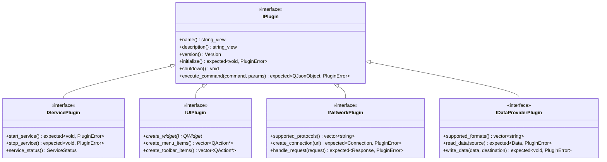
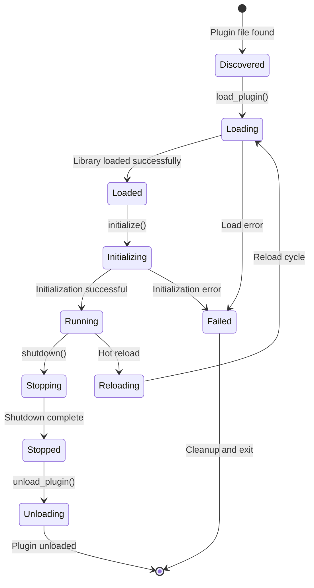
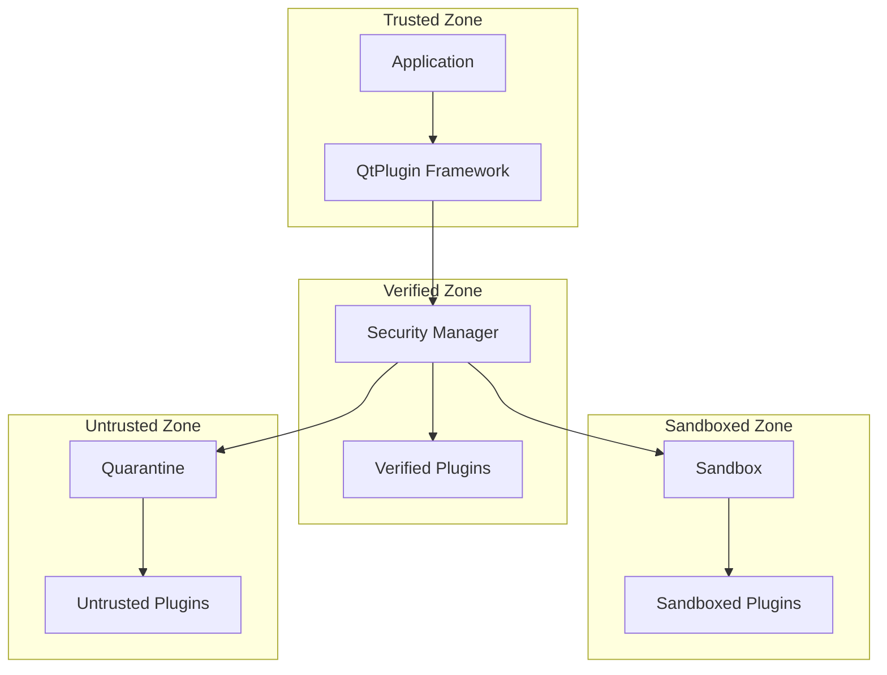

# Architecture Overview

QtPlugin is built on a modular, layered architecture that provides flexibility, security, and performance for plugin-based applications.

## System Architecture

```mermaid
graph TB
    subgraph "Application Layer"
        App[Application Code]
        AppLogic[Business Logic]
        AppUI[User Interface]
    end
    
    subgraph "QtPlugin Framework"
        subgraph "Core Layer"
            PM[Plugin Manager]
            PL[Plugin Loader]
            PR[Plugin Registry]
            LC[Lifecycle Controller]
        end
        
        subgraph "Communication Layer"
            MB[Message Bus]
            MT[Message Types]
            EC[Event Controller]
            RPC[RPC System]
        end
        
        subgraph "Security Layer"
            SM[Security Manager]
            PV[Plugin Validator]
            TM[Trust Manager]
            SB[Sandbox Controller]
        end
        
        subgraph "Configuration Layer"
            CM[Configuration Manager]
            CS[Config Store]
            CV[Config Validator]
        end
    end
    
    subgraph "Plugin Layer"
        subgraph "Plugin Types"
            SP[Service Plugins]
            UP[UI Plugins]
            NP[Network Plugins]
            DP[Data Plugins]
        end
        
        subgraph "Plugin Interfaces"
            IPI[IPlugin]
            ISP[IServicePlugin]
            IUP[IUIPlugin]
            INP[INetworkPlugin]
        end
    end
    
    subgraph "System Layer"
        FS[File System]
        OS[Operating System]
        Qt[Qt Framework]
    end
    
    App --> PM
    AppLogic --> PM
    AppUI --> PM
    
    PM --> PL
    PM --> PR
    PM --> LC
    PM --> MB
    PM --> SM
    PM --> CM
    
    PL --> SP
    PL --> UP
    PL --> NP
    PL --> DP
    
    SP --> IPI
    UP --> IUP
    NP --> INP
    DP --> IPI
    
    SM --> PV
    SM --> TM
    SM --> SB
    
    CM --> CS
    CM --> CV
    
    PL --> FS
    SM --> OS
    PM --> Qt
```



## Core Components

### Plugin Manager

The **Plugin Manager** is the central orchestrator of the plugin system:

**Responsibilities:**

- Plugin discovery and registration
- Lifecycle management (load, initialize, shutdown, unload)
- Dependency resolution between plugins
- State monitoring and health checks
- Resource allocation and cleanup

**Key Features:**

- Thread-safe operations
- Asynchronous plugin loading
- Hot reloading support
- Plugin isolation and sandboxing
- Performance monitoring

```cpp
class PluginManager {
public:
    // Plugin lifecycle
    expected<std::string, PluginError> load_plugin(const std::filesystem::path& path);
    expected<void, PluginError> unload_plugin(const std::string& plugin_id);
    
    // Plugin discovery
    std::vector<std::filesystem::path> discover_plugins(const std::filesystem::path& directory = {});
    
    // Plugin access
    std::shared_ptr<IPlugin> get_plugin(const std::string& plugin_id);
    std::vector<std::shared_ptr<IPlugin>> get_plugins_by_capability(PluginCapability capability);
    
    // Configuration
    void add_search_path(const std::filesystem::path& path);
    void set_security_level(SecurityLevel level);
};
```

### Plugin Loader

The **Plugin Loader** handles the low-level mechanics of plugin loading:

**Responsibilities:**

- Dynamic library loading and unloading
- Symbol resolution and interface validation
- Memory management and cleanup
- Error handling and recovery

**Implementation Details:**

- Uses Qt's QPluginLoader for cross-platform compatibility
- Implements custom deleter for proper cleanup
- Validates plugin interfaces at load time
- Handles platform-specific library formats (.dll, .so, .dylib)

### Security Manager

The **Security Manager** ensures plugin safety and system integrity:

**Security Features:**

- Digital signature verification
- Trust level management
- Plugin sandboxing
- Resource access control
- Audit logging

**Trust Levels:**

- **Trusted**: Full system access
- **Verified**: Limited system access
- **Sandboxed**: Restricted access
- **Untrusted**: Minimal access

### Communication System

The **Communication System** enables inter-plugin communication:

**Message Bus:**

- Type-safe message passing
- Publish-subscribe pattern
- Request-response messaging
- Event broadcasting

**Message Types:**

- Synchronous messages
- Asynchronous events
- Broadcast notifications
- Direct plugin-to-plugin calls

## Plugin Architecture

### Plugin Interface Hierarchy



### Plugin Lifecycle



## Design Principles

### 1. Separation of Concerns

Each component has a single, well-defined responsibility:

- **Plugin Manager**: Orchestration and lifecycle
- **Plugin Loader**: Low-level loading mechanics
- **Security Manager**: Safety and validation
- **Communication System**: Inter-plugin messaging

### 2. Interface Segregation

Plugins implement only the interfaces they need:

- Base `IPlugin` for all plugins
- Specialized interfaces for specific capabilities
- Optional interfaces for advanced features

### 3. Dependency Inversion

High-level modules don't depend on low-level modules:

- Plugins depend on abstractions (interfaces)
- Framework provides implementations
- Easy to mock and test

### 4. Open/Closed Principle

The system is:

- **Open for extension**: New plugin types can be added
- **Closed for modification**: Core framework remains stable

## Performance Considerations

### Memory Management

- **RAII**: Automatic resource cleanup
- **Smart Pointers**: Shared ownership with automatic cleanup
- **Plugin Isolation**: Each plugin has its own memory space
- **Lazy Loading**: Plugins loaded only when needed

### Threading

- **Thread Safety**: All public APIs are thread-safe
- **Async Operations**: Non-blocking plugin operations
- **Worker Threads**: Background processing for plugins
- **Synchronization**: Minimal locking with modern C++ primitives

### Optimization

- **Plugin Caching**: Metadata cached for fast access
- **Dependency Resolution**: Optimized dependency graph
- **Hot Paths**: Critical paths optimized for performance
- **Memory Pools**: Efficient memory allocation

## Security Model

### Trust Boundaries



### Security Features

1. **Plugin Validation**: Signature verification and integrity checks
2. **Sandboxing**: Restricted execution environment
3. **Access Control**: Fine-grained permission system
4. **Audit Logging**: Complete security event logging
5. **Trust Management**: Dynamic trust level adjustment

## Extensibility

### Adding New Plugin Types

1. Define new interface inheriting from `IPlugin`
2. Implement specialized plugin loader if needed
3. Add capability flags for the new type
4. Update plugin manager to handle new type

### Custom Communication Patterns

1. Define new message types
2. Implement custom message handlers
3. Register with the message bus
4. Document the new patterns

### Platform-Specific Features

1. Use conditional compilation for platform code
2. Implement platform-specific interfaces
3. Provide fallback implementations
4. Test on all supported platforms

---

**Next**: [Design Principles](design-principles.md) for detailed design philosophy.
