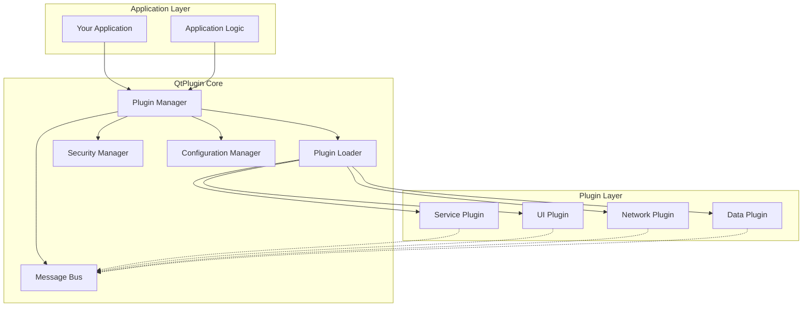
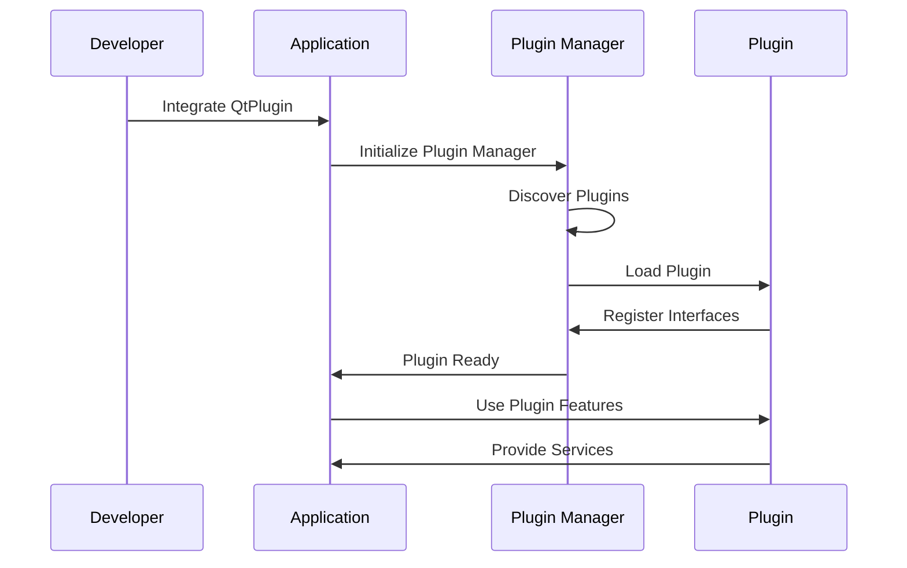

# QtPlugin Overview

QtPlugin is a comprehensive, modern C++ plugin system designed specifically for Qt applications. It provides a robust foundation for building modular, extensible applications with dynamic plugin loading capabilities.

## What Makes QtPlugin Special?

### Pure C++ Design

Unlike traditional Qt plugin systems that often require QML integration, QtPlugin is designed to work in **pure C++ environments**. This makes it suitable for:

- Console applications
- System services
- Embedded applications
- Legacy C++ codebases
- Performance-critical applications

### Modern C++ Standards

QtPlugin leverages the latest C++ features:

- **C++20 Concepts** for type safety and compile-time validation
- **std::expected** for robust error handling
- **RAII principles** for automatic resource management
- **Smart pointers** for memory safety
- **Thread-safe operations** using modern synchronization primitives

### Enterprise-Grade Features

Built for production use with:

- **Security validation** and plugin sandboxing
- **Performance monitoring** and metrics collection
- **Hot reloading** for development and maintenance
- **Dependency resolution** between plugins
- **Configuration management** with JSON support
- **Cross-platform compatibility** (Windows, macOS, Linux)

## Architecture Overview

## Key Components

### Plugin Manager

The central component that orchestrates plugin operations:

- Plugin discovery and loading
- Lifecycle management
- Dependency resolution
- State monitoring

### Plugin Loader

Handles the low-level plugin loading mechanics:

- Dynamic library loading
- Interface validation
- Memory management
- Error handling

### Security Manager

Ensures plugin safety and validation:

- Digital signature verification
- Trust level management
- Sandboxing capabilities
- Security policy enforcement

### Communication System

Enables inter-plugin communication:

- Message bus for loose coupling
- Type-safe message passing
- Event broadcasting
- Request-response patterns

## Plugin Types

QtPlugin supports various plugin types through specialized interfaces:

### Service Plugins (`IServicePlugin`)

- Background processing
- System monitoring
- Scheduled tasks
- Data synchronization

### UI Plugins (`IUIPlugin`)

- Custom widgets
- Dialog boxes
- Tool windows
- Menu contributions

### Network Plugins (`INetworkPlugin`)

- Protocol implementations
- API integrations
- Network services
- Communication protocols

### Data Provider Plugins (`IDataProviderPlugin`)

- Database connectors
- File format handlers
- Data transformers
- Import/export functionality

### Scripting Plugins (`IScriptingPlugin`)

- Script engines
- Language bindings
- Automation tools
- Custom DSLs

## Development Workflow

## Benefits for Different Roles

### For Application Developers

- **Easy Integration**: Simple API for plugin management
- **Flexible Architecture**: Modular application design
- **Reduced Complexity**: Built-in dependency management
- **Better Maintainability**: Clear separation of concerns

### For Plugin Developers

- **Clear Interfaces**: Well-defined plugin contracts
- **Rich Functionality**: Comprehensive plugin capabilities
- **Development Tools**: Debugging and profiling support
- **Documentation**: Extensive guides and examples

### For System Architects

- **Scalable Design**: Support for large plugin ecosystems
- **Security Model**: Built-in security and validation
- **Performance**: Optimized for production workloads
- **Cross-Platform**: Consistent behavior across platforms

## Use Cases

### Text Editors and IDEs

- Syntax highlighting plugins
- Language servers
- Code formatters
- Version control integrations

### Media Applications

- Codec plugins
- Effect processors
- Format converters
- Streaming protocols

### Database Tools

- Database drivers
- Query builders
- Data visualizers
- Import/export tools

### System Utilities

- Monitoring plugins
- Backup solutions
- Network tools
- System diagnostics

## Getting Started

Ready to start using QtPlugin? Here's your next steps:

1. **[Installation](installation.md)** - Set up QtPlugin in your project
2. **[Quick Start](quick-start.md)** - Build your first plugin-enabled application
3. **[First Plugin](first-plugin.md)** - Create your first plugin
4. **[Examples](../examples/index.md)** - Explore working examples

## Requirements

- **CMake**: 3.21 or higher
- **Qt6**: 6.2 or higher (Core module required)
- **C++20 Compiler**:
  - MSVC 2019 16.11+ (Windows)
  - GCC 10+ (Linux)
  - Clang 12+ (macOS/Linux)

## License

QtPlugin is released under the MIT License, making it suitable for both open-source and commercial projects.

---

**Next**: [Installation Guide](installation.md) to set up QtPlugin in your project.
