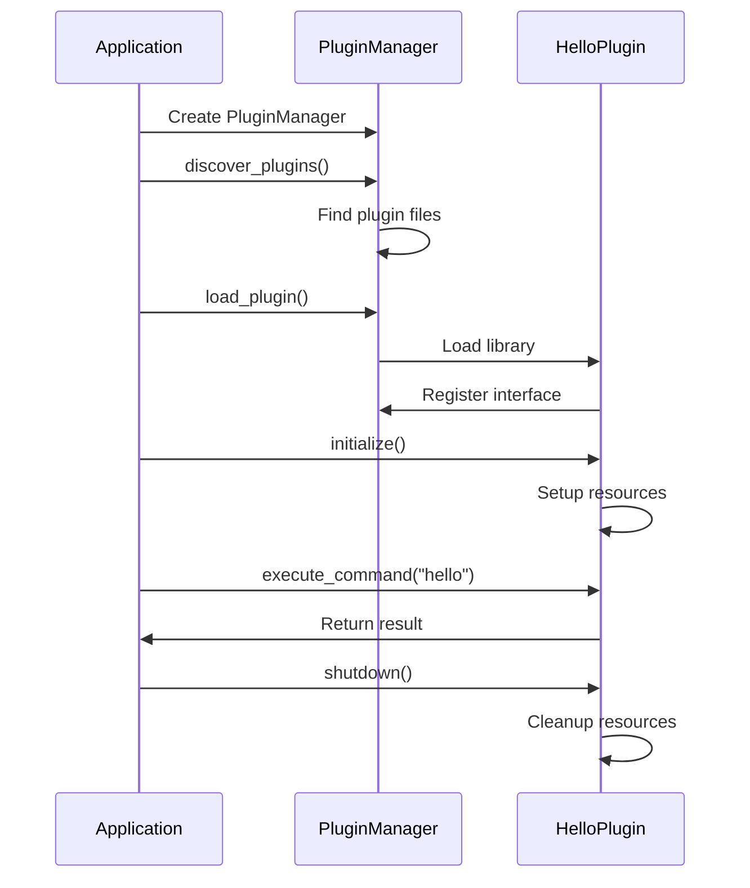

# Quick Start Guide

Get up and running with QtPlugin in just a few minutes! This guide walks you through creating your first plugin-enabled application.

## What You'll Build

By the end of this guide, you'll have:

- ✅ A simple Qt application that uses QtPlugin
- ✅ A "Hello World" plugin that demonstrates basic functionality
- ✅ Understanding of the core QtPlugin concepts

## Prerequisites

Before starting, ensure you have:

- **Qt6** (6.2 or higher) installed
- **CMake** 3.21 or higher
- **C++20 compatible compiler**
- Basic knowledge of C++ and Qt

## Step 1: Create Your Project

Create a new directory for your project:

```bash
mkdir qtplugin-quickstart
cd qtplugin-quickstart
```

Create a `CMakeLists.txt` file:

```cmake
cmake_minimum_required(VERSION 3.21)
project(QtPluginQuickStart)

# Set C++20 standard
set(CMAKE_CXX_STANDARD 20)
set(CMAKE_CXX_STANDARD_REQUIRED ON)

# Find Qt6
find_package(Qt6 REQUIRED COMPONENTS Core)

# Add QtPlugin using FetchContent
include(FetchContent)
FetchContent_Declare(
    QtPlugin
    GIT_REPOSITORY https://github.com/example/qt-plugin-sample.git
    GIT_TAG        v3.0.0
    SOURCE_SUBDIR  lib
)
FetchContent_MakeAvailable(QtPlugin)

# Create the main application
add_executable(QtPluginQuickStart main.cpp)
target_link_libraries(QtPluginQuickStart 
    PRIVATE 
    QtPlugin::Core
    Qt6::Core
)

# Create a simple plugin
add_library(HelloPlugin SHARED hello_plugin.cpp)
target_link_libraries(HelloPlugin PRIVATE QtPlugin::Core Qt6::Core)

# Set plugin output directory
set_target_properties(HelloPlugin PROPERTIES
    LIBRARY_OUTPUT_DIRECTORY "${CMAKE_BINARY_DIR}/plugins"
    RUNTIME_OUTPUT_DIRECTORY "${CMAKE_BINARY_DIR}/plugins"
)
```

## Step 2: Create the Main Application

Create `main.cpp` with the following content:

```cpp
#include <qtplugin/qtplugin.hpp>
#include <QCoreApplication>
#include <QDir>
#include <iostream>

int main(int argc, char *argv[]) {
    QCoreApplication app(argc, argv);
    
    // Initialize QtPlugin
    qtplugin::LibraryInitializer init;
    if (!init.is_initialized()) {
        std::cerr << "Failed to initialize QtPlugin library" << std::endl;
        return -1;
    }
    
    std::cout << "🚀 QtPlugin initialized successfully!" << std::endl;
    std::cout << "📦 Version: " << qtplugin::version() << std::endl;
    
    // Create plugin manager
    qtplugin::PluginManager manager;
    
    // Add plugin search path
    QDir pluginDir(QCoreApplication::applicationDirPath() + "/plugins");
    if (pluginDir.exists()) {
        manager.add_search_path(pluginDir.absolutePath().toStdString());
        std::cout << "📁 Plugin search path: " << pluginDir.absolutePath().toStdString() << std::endl;
    }
    
    // Discover and load plugins
    auto discovered = manager.discover_plugins();
    std::cout << "🔍 Discovered " << discovered.size() << " plugins" << std::endl;
    
    for (const auto& plugin_path : discovered) {
        std::cout << "\n🔌 Loading: " << plugin_path.filename().string() << std::endl;
        
        auto result = manager.load_plugin(plugin_path);
        if (result) {
            auto plugin = manager.get_plugin(result.value());
            if (plugin) {
                std::cout << "  ✅ Name: " << plugin->name() << std::endl;
                std::cout << "  📝 Description: " << plugin->description() << std::endl;
                std::cout << "  🏷️  Version: " << plugin->version().to_string() << std::endl;
                
                // Initialize and test the plugin
                auto init_result = plugin->initialize();
                if (init_result) {
                    // Execute hello command
                    auto cmd_result = plugin->execute_command("hello");
                    if (cmd_result) {
                        auto response = cmd_result.value();
                        if (response.contains("message")) {
                            std::cout << "  💬 " << response["message"].toString().toStdString() << std::endl;
                        }
                    }
                }
            }
        } else {
            std::cout << "  ❌ Failed: " << result.error().message << std::endl;
        }
    }
    
    std::cout << "\n🎉 Application completed successfully!" << std::endl;
    return 0;
}
```

## Step 3: Create Your First Plugin

Create `hello_plugin.cpp`:

```cpp
#include <qtplugin/qtplugin.hpp>
#include <QObject>
#include <QJsonObject>
#include <QDateTime>
#include <iostream>

class HelloPlugin : public QObject, public qtplugin::IPlugin {
    Q_OBJECT
    QTPLUGIN_DECLARE_PLUGIN(HelloPlugin, "com.example.HelloPlugin/1.0", "hello_plugin.json")

public:
    // Plugin metadata
    std::string_view name() const noexcept override {
        return "Hello World Plugin";
    }
    
    std::string_view description() const noexcept override {
        return "A simple demonstration plugin";
    }
    
    qtplugin::Version version() const noexcept override {
        return {1, 0, 0};
    }
    
    std::string_view author() const noexcept override {
        return "QtPlugin Team";
    }
    
    std::string id() const noexcept override {
        return "com.example.helloworld";
    }
    
    // Plugin lifecycle
    qtplugin::expected<void, qtplugin::PluginError> initialize() override {
        std::cout << "HelloPlugin: Initializing..." << std::endl;
        return qtplugin::make_success();
    }
    
    void shutdown() noexcept override {
        std::cout << "HelloPlugin: Shutting down..." << std::endl;
    }
    
    qtplugin::PluginState state() const noexcept override {
        return qtplugin::PluginState::Running;
    }
    
    qtplugin::PluginCapabilities capabilities() const noexcept override {
        return qtplugin::PluginCapability::Service;
    }
    
    // Commands
    qtplugin::expected<QJsonObject, qtplugin::PluginError>
    execute_command(std::string_view command, const QJsonObject& params = {}) override {
        if (command == "hello") {
            QJsonObject result;
            result["message"] = "Hello from QtPlugin! 👋";
            result["timestamp"] = QDateTime::currentDateTime().toString();
            result["plugin"] = QString::fromStdString(std::string(name()));
            return result;
        } else if (command == "info") {
            QJsonObject result;
            result["name"] = QString::fromStdString(std::string(name()));
            result["version"] = QString::fromStdString(version().to_string());
            result["author"] = QString::fromStdString(std::string(author()));
            result["capabilities"] = static_cast<int>(capabilities());
            return result;
        }
        
        return qtplugin::make_error<QJsonObject>(
            qtplugin::PluginErrorCode::CommandNotFound, 
            "Unknown command: " + std::string(command)
        );
    }
    
    std::vector<std::string> available_commands() const override {
        return {"hello", "info"};
    }
};

#include "hello_plugin.moc"
```

## Step 4: Create Plugin Metadata

Create `hello_plugin.json` (optional but recommended):

```json
{
    "name": "Hello World Plugin",
    "version": "1.0.0",
    "description": "A simple demonstration plugin",
    "author": "QtPlugin Team",
    "license": "MIT",
    "category": "Example",
    "capabilities": ["Service"],
    "dependencies": [],
    "metadata": {
        "homepage": "https://qtplugin.dev",
        "repository": "https://github.com/example/qt-plugin-sample"
    }
}
```

## Step 5: Build and Run

Build your project:

```bash
mkdir build && cd build
cmake ..
cmake --build .
```

Run the application:

=== "Windows"
    ```cmd
    .\QtPluginQuickStart.exe
    ```

=== "Linux/macOS"
    ```bash
    ./QtPluginQuickStart
    ```

## Expected Output

You should see output similar to:

```
🚀 QtPlugin initialized successfully!
📦 Version: 3.0.0
📁 Plugin search path: /path/to/build/plugins
🔍 Discovered 1 plugins

🔌 Loading: HelloPlugin.dll
HelloPlugin: Initializing...
  ✅ Name: Hello World Plugin
  📝 Description: A simple demonstration plugin
  🏷️  Version: 1.0.0
  💬 Hello from QtPlugin! 👋

🎉 Application completed successfully!
```

## Understanding the Code

### Key Components

1. **LibraryInitializer**: RAII wrapper that initializes QtPlugin
2. **PluginManager**: Central component for managing plugins
3. **IPlugin Interface**: Base interface all plugins must implement
4. **Plugin Metadata**: Information about the plugin (name, version, etc.)
5. **Commands**: Plugin functionality exposed through commands

### Plugin Lifecycle



## Next Steps

Congratulations! You've created your first QtPlugin application. Here's what to explore next:

1. **[First Plugin Tutorial](first-plugin.md)** - Create more complex plugins
2. **[User Guide](../user-guide/index.md)** - Learn about plugin management
3. **[API Reference](../api/index.md)** - Explore the complete API
4. **[Examples](../examples/index.md)** - Study more complex examples

## Troubleshooting

### Common Issues

**Plugin not found**: Ensure the plugin is built and in the correct directory
**Initialization failed**: Check that Qt6 is properly installed and in PATH
**Compilation errors**: Verify C++20 compiler support and Qt6 version

For more help, see the [Troubleshooting Guide](../user-guide/troubleshooting.md).

---

**Next**: [Create Your First Plugin](first-plugin.md) for a deeper dive into plugin development.
