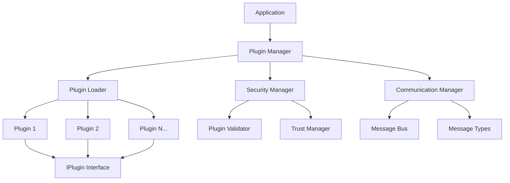

# QtPlugin Documentation

Welcome to the comprehensive documentation for **QtPlugin** - a modern, pure C++ plugin system designed for Qt applications with revolutionary modular component architecture (v3.0.0).

<div class="grid cards" markdown>

- :material-rocket-launch:{ .lg .middle } **Getting Started**

    ---

    New to QtPlugin? Start here to get up and running quickly with installation, basic usage, and your first plugin.

    [:octicons-arrow-right-24: Quick Start](getting-started/quick-start.md)

- :material-book-open-variant:{ .lg .middle } **User Guide**

    ---

    Complete guide for integrating QtPlugin into your applications, managing plugins, and configuration.

    [:octicons-arrow-right-24: User Guide](user-guide/index.md)

- :material-code-braces:{ .lg .middle } **Developer Guide**

    ---

    Learn how to create powerful plugins with our comprehensive development guide and best practices.

    [:octicons-arrow-right-24: Developer Guide](developer-guide/index.md)

- :material-api:{ .lg .middle } **API Reference**

    ---

    Complete API documentation with detailed interface descriptions, examples, and usage patterns.

    [:octicons-arrow-right-24: API Reference](api/index.md)

</div>

## What is QtPlugin?

QtPlugin is a **production-ready**, **enterprise-grade** C++ plugin system built on Qt 6 that provides:

### :material-check-circle:{ .green } Core Features

- **Pure C++ Implementation** - No QML dependencies, works in any C++ application
- **Modern C++ Standards** - Leverages C++17/20/23 features including concepts and `std::expected`
- **Type Safety** - Compile-time validation using C++20 concepts
- **Thread Safety** - Safe concurrent plugin operations
- **Minimal Dependencies** - Core library depends only on Qt6::Core

### :material-lightning-bolt:{ .yellow } Advanced Capabilities

- **Dynamic Loading** - Load and unload plugins at runtime
- **Hot Reloading** - Dynamic plugin reloading during runtime
- **Lifecycle Management** - Complete plugin lifecycle control with state management
- **Dependency Resolution** - Automatic dependency management between plugins
- **Security Validation** - Plugin validation and sandboxing capabilities
- **Performance Monitoring** - Real-time performance tracking and metrics

### :material-puzzle:{ .purple } Component Architecture (v3.0.0)

- **Modular Design** - Focused, single-responsibility components
- **Enhanced Testability** - Components can be tested in isolation
- **Flexible Composition** - Mix and match components for custom solutions
- **Direct Component Access** - Use components directly for advanced scenarios
- **Custom Implementations** - Replace components with custom implementations
- **Backward Compatibility** - 100% API preservation for existing code

### :material-shield-check:{ .blue } Production Ready

- **Configuration Management** - Flexible JSON-based plugin configuration
- **Inter-Plugin Communication** - Message bus for plugin-to-plugin communication
- **Error Handling** - Robust error management with custom `expected<T,E>`
- **Resource Management** - Efficient memory and resource management
- **Cross-Platform** - Supports Windows, macOS, and Linux

## Quick Example

Here's a simple example of using QtPlugin in your application:

```cpp
#include <qtplugin/qtplugin.hpp>
#include <iostream>

int main() {
    // Initialize the library
    qtplugin::LibraryInitializer init;
    if (!init.is_initialized()) {
        std::cerr << "Failed to initialize QtPlugin library" << std::endl;
        return -1;
    }

    // Create plugin manager
    qtplugin::PluginManager manager;

    // Load a plugin
    auto result = manager.load_plugin("./plugins/example.qtplugin");
    if (!result) {
        std::cerr << "Failed to load plugin: " << result.error().message << std::endl;
        return -1;
    }

    // Get and use the plugin
    auto plugin = manager.get_plugin(result.value());
    if (plugin) {
        auto init_result = plugin->initialize();
        if (init_result) {
            std::cout << "Plugin loaded: " << plugin->name() << std::endl;
        }
    }

    return 0;
}
```

## Architecture Overview



## Key Benefits

!!! success "Why Choose QtPlugin?"

    - **🚀 Fast Development** - Get started in minutes with comprehensive examples
    - **🔒 Secure by Design** - Built-in security validation and sandboxing
    - **⚡ High Performance** - Optimized for production workloads
    - **🔧 Developer Friendly** - Clear APIs and extensive documentation
    - **🏗️ Extensible** - Modular architecture supports easy customization
    - **📱 Cross-Platform** - Works on Windows, macOS, and Linux

## Version Information

- **Current Version**: 3.0.0
- **API Version**: 3.0
- **Minimum Qt Version**: 6.2.0
- **C++ Standard**: C++20
- **License**: MIT

## Community and Support

- **GitHub Repository**: [qt-plugin-sample](https://github.com/example/qt-plugin-sample)
- **Issue Tracker**: Report bugs and request features
- **Discussions**: Join the community discussions
- **Documentation**: This comprehensive documentation site

## Next Steps

<div class="grid cards" markdown>

- **New Users**

    1. [Installation Guide](getting-started/installation.md)
    2. [Quick Start Tutorial](getting-started/quick-start.md)
    3. [Basic Examples](examples/basic-examples.md)

- **Plugin Developers**

    1. [Plugin Development Guide](developer-guide/plugin-development.md)
    2. [API Reference](api/index.md)
    3. [Plugin Examples](examples/index.md)

- **Application Integrators**

    1. [Integration Guide](user-guide/integration.md)
    2. [Architecture Overview](architecture/index.md)
    3. [Deployment Guide](deployment/index.md)

</div>

---

**QtPlugin v3.0.0** - A modern, production-ready plugin system for Qt applications.
