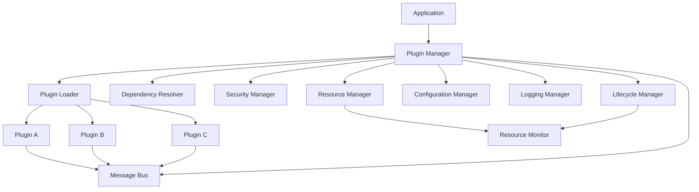

# QtPlugin Architecture Guide

This document describes the architecture and design principles of the QtPlugin library.

## Overview

QtPlugin is designed as a modern, enterprise-grade plugin system that emphasizes:
- **Type Safety**: Compile-time validation using C++20 concepts
- **Error Handling**: Modern error handling without exceptions using expected<T,E>
- **Performance**: Efficient plugin loading and communication
- **Security**: Plugin validation and sandboxing
- **Modularity**: Clean separation of concerns with dependency injection

## Core Architecture

### High-Level Architecture

```
┌─────────────────────────────────────────────────────────────┐
│                    Application Layer                        │
├─────────────────────────────────────────────────────────────┤
│                    QtPlugin API                             │
├─────────────────────────────────────────────────────────────┤
│  Plugin Manager  │  Message Bus  │  Security Manager       │
├─────────────────────────────────────────────────────────────┤
│  Resource Mgr    │  Config Mgr   │  Logging Manager        │
├─────────────────────────────────────────────────────────────┤
│  Plugin Loader   │  Dependency   │  Lifecycle Manager      │
│                  │  Resolver     │                         │
├─────────────────────────────────────────────────────────────┤
│                    Qt Framework                             │
└─────────────────────────────────────────────────────────────┘
```

### Component Relationships



## Core Components

### Plugin Manager

The central orchestrator responsible for:
- Plugin discovery and loading
- Lifecycle management
- Dependency resolution
- Error handling and recovery
- Event coordination

**Key Design Patterns:**
- **Facade Pattern**: Provides simplified interface to complex subsystem
- **Observer Pattern**: Notifies subscribers of plugin events
- **Factory Pattern**: Creates plugin instances through dependency injection

```cpp
class PluginManager {
    // Composition over inheritance
    std::unique_ptr<PluginLoader> m_loader;
    std::unique_ptr<DependencyResolver> m_resolver;
    std::unique_ptr<SecurityManager> m_security;
    std::unique_ptr<ResourceManager> m_resources;
    // ... other managers
};
```

### Plugin Interface

Defines the contract that all plugins must implement:

**Design Principles:**
- **Interface Segregation**: Minimal, focused interface
- **Dependency Inversion**: Plugins depend on abstractions, not concretions
- **Open/Closed**: Open for extension, closed for modification

```cpp
class IPlugin {
    // Core lifecycle (required)
    virtual expected<void, PluginError> initialize() = 0;
    virtual void shutdown() = 0;
    
    // Metadata (required)
    virtual PluginMetadata metadata() const = 0;
    
    // Configuration (optional)
    virtual expected<void, PluginError> configure(const QJsonObject&) = 0;
    
    // Command execution (optional)
    virtual expected<QJsonObject, PluginError> execute_command(...) = 0;
};
```

### Error Handling System

Modern error handling without exceptions:

**Design Philosophy:**
- **Explicit Error Handling**: All errors are explicit in function signatures
- **Composable**: Errors can be chained and transformed
- **Type Safe**: Compile-time error checking
- **Performance**: No exception overhead

```cpp
template<typename T, typename E>
class expected {
    // Monadic operations for error composition
    template<typename F>
    auto and_then(F&& f) const -> expected<...>;
    
    template<typename F>
    auto or_else(F&& f) const -> expected<T, ...>;
    
    template<typename F>
    auto transform(F&& f) const -> expected<...>;
};
```

### Resource Management

Automatic resource tracking and cleanup:

**RAII Principles:**
- **Automatic Cleanup**: Resources cleaned up when plugins unload
- **Exception Safety**: Strong exception safety guarantees
- **Leak Prevention**: Automatic detection of resource leaks

```cpp
class ResourceManager {
    // Resource factories for different types
    std::map<std::string, std::unique_ptr<ResourceFactory>> m_factories;
    
    // Per-plugin resource tracking
    std::map<std::string, std::vector<ResourceHandle>> m_plugin_resources;
    
    // Automatic cleanup on plugin unload
    void cleanup_plugin_resources(const std::string& plugin_id);
};
```

## Design Patterns

### Factory Pattern

Used throughout for object creation and dependency injection:

```cpp
// Abstract factory for managers
class ManagerFactory {
public:
    virtual std::unique_ptr<ConfigurationManager> create_configuration_manager() = 0;
    virtual std::unique_ptr<LoggingManager> create_logging_manager() = 0;
    virtual std::unique_ptr<ResourceManager> create_resource_manager() = 0;
};

// Concrete factory with dependency injection
class DefaultManagerFactory : public ManagerFactory {
    // Implementations create managers with proper dependencies
};
```

### Observer Pattern

Event notification system:

```cpp
class PluginManager : public QObject {
    Q_OBJECT
    
signals:
    void plugin_loaded(const QString& plugin_id);
    void plugin_unloaded(const QString& plugin_id);
    void plugin_error(const QString& plugin_id, const QString& error);
    
    // Internal event coordination
private slots:
    void on_plugin_state_changed(const QString& plugin_id, PluginState state);
};
```

### Strategy Pattern

Configurable behavior for security, validation, and loading:

```cpp
class SecurityManager {
    std::unique_ptr<ValidationStrategy> m_validator;
    std::unique_ptr<SignatureStrategy> m_signature_checker;
    
public:
    void set_validation_strategy(std::unique_ptr<ValidationStrategy> strategy);
    void set_signature_strategy(std::unique_ptr<SignatureStrategy> strategy);
};
```

### Command Pattern

Plugin command execution:

```cpp
class PluginCommand {
public:
    virtual expected<QJsonObject, PluginError> execute(
        IPlugin* plugin, 
        const QJsonObject& params
    ) = 0;
};

class CommandRegistry {
    std::map<std::string, std::unique_ptr<PluginCommand>> m_commands;
    
public:
    void register_command(const std::string& name, std::unique_ptr<PluginCommand> cmd);
    expected<QJsonObject, PluginError> execute_command(
        const std::string& name, 
        IPlugin* plugin, 
        const QJsonObject& params
    );
};
```

## Memory Management

### Smart Pointer Usage

Consistent use of smart pointers for automatic memory management:

```cpp
// Ownership semantics
std::unique_ptr<T>  // Exclusive ownership
std::shared_ptr<T>  // Shared ownership
std::weak_ptr<T>    // Non-owning reference

// Plugin storage
std::map<std::string, std::shared_ptr<IPlugin>> m_plugins;

// Manager storage
std::unique_ptr<PluginLoader> m_loader;  // Exclusive ownership
```

### RAII Principles

All resources follow RAII:

```cpp
class PluginHandle {
    std::string m_plugin_id;
    PluginManager* m_manager;
    
public:
    PluginHandle(const std::string& id, PluginManager* mgr)
        : m_plugin_id(id), m_manager(mgr) {}
    
    ~PluginHandle() {
        if (m_manager) {
            m_manager->unload_plugin(m_plugin_id);
        }
    }
    
    // Move-only semantics
    PluginHandle(const PluginHandle&) = delete;
    PluginHandle& operator=(const PluginHandle&) = delete;
    PluginHandle(PluginHandle&&) = default;
    PluginHandle& operator=(PluginHandle&&) = default;
};
```

## Thread Safety

### Synchronization Strategy

Thread-safe design with minimal locking:

```cpp
class PluginManager {
    mutable std::shared_mutex m_plugins_mutex;
    std::map<std::string, std::shared_ptr<IPlugin>> m_plugins;
    
public:
    // Read operations use shared lock
    std::shared_ptr<IPlugin> get_plugin(const std::string& id) const {
        std::shared_lock lock(m_plugins_mutex);
        auto it = m_plugins.find(id);
        return (it != m_plugins.end()) ? it->second : nullptr;
    }
    
    // Write operations use exclusive lock
    expected<std::string, PluginError> load_plugin(const std::string& path) {
        std::unique_lock lock(m_plugins_mutex);
        // ... loading logic
    }
};
```

### Lock-Free Operations

Where possible, use lock-free data structures:

```cpp
// Atomic counters for statistics
std::atomic<size_t> m_plugins_loaded{0};
std::atomic<size_t> m_commands_executed{0};

// Lock-free message queue for inter-plugin communication
class LockFreeMessageQueue {
    std::atomic<Node*> m_head;
    std::atomic<Node*> m_tail;
    
public:
    void enqueue(const Message& msg);
    bool dequeue(Message& msg);
};
```

## Performance Considerations

### Plugin Loading Optimization

- **Lazy Loading**: Plugins loaded on-demand
- **Parallel Loading**: Independent plugins loaded concurrently
- **Caching**: Metadata cached to avoid repeated file I/O

```cpp
class PluginLoader {
    // Metadata cache
    std::map<std::string, PluginMetadata> m_metadata_cache;
    
    // Async loading
    std::future<expected<std::shared_ptr<IPlugin>, PluginError>> 
    load_plugin_async(const std::string& path);
    
    // Batch loading
    std::vector<std::future<...>> load_plugins_batch(
        const std::vector<std::string>& paths
    );
};
```

### Memory Optimization

- **Object Pooling**: Reuse objects where appropriate
- **Small String Optimization**: Efficient string handling
- **Memory Mapping**: For large plugin files

### Communication Optimization

- **Message Batching**: Batch small messages
- **Zero-Copy**: Avoid unnecessary data copying
- **Compression**: Compress large messages

## Security Architecture

### Defense in Depth

Multiple layers of security:

1. **File System**: Plugin file validation
2. **Loading**: Signature verification
3. **Runtime**: Sandboxing and capability restrictions
4. **Communication**: Message validation and filtering

```cpp
class SecurityManager {
    // Multi-layer validation
    expected<void, SecurityError> validate_file(const std::string& path);
    expected<void, SecurityError> verify_signature(const std::string& path);
    expected<void, SecurityError> check_capabilities(const PluginMetadata& meta);
    expected<void, SecurityError> validate_runtime_behavior(IPlugin* plugin);
};
```

### Capability-Based Security

Plugins declare required capabilities:

```cpp
struct PluginCapabilities {
    bool requires_network = false;
    bool requires_filesystem = false;
    bool requires_ui = false;
    std::vector<std::string> required_permissions;
};
```

## Extensibility

### Plugin Types

Support for different plugin types through interfaces:

```cpp
// Base plugin interface
class IPlugin { /* ... */ };

// Specialized interfaces
class IServicePlugin : public IPlugin { /* ... */ };
class IDataProcessorPlugin : public IPlugin { /* ... */ };
class INetworkPlugin : public IPlugin { /* ... */ };
class IUIPlugin : public IPlugin { /* ... */ };
```

### Custom Managers

Framework allows custom manager implementations:

```cpp
// Custom configuration manager
class DatabaseConfigurationManager : public ConfigurationManager {
    // Store configuration in database instead of files
};

// Custom security manager
class EnterpriseSecurityManager : public SecurityManager {
    // Enterprise-specific security policies
};
```

## Testing Architecture

### Testability Design

- **Dependency Injection**: Easy to mock dependencies
- **Interface-Based**: All components behind interfaces
- **Isolated Components**: Components can be tested in isolation

```cpp
// Mock implementations for testing
class MockPluginLoader : public PluginLoader {
    // Controlled plugin loading for tests
};

class MockSecurityManager : public SecurityManager {
    // Configurable security behavior for tests
};
```

### Test Categories

1. **Unit Tests**: Individual component testing
2. **Integration Tests**: Component interaction testing
3. **Performance Tests**: Load and stress testing
4. **Security Tests**: Vulnerability and penetration testing

## Future Extensibility

The architecture is designed to support future enhancements:

- **Distributed Plugins**: Remote plugin loading and execution
- **Hot Swapping**: Runtime plugin replacement
- **Plugin Composition**: Combining multiple plugins
- **AI Integration**: Machine learning-based plugin recommendations
- **Cloud Integration**: Cloud-based plugin repositories

## Best Practices

1. **Follow SOLID Principles**: Single responsibility, open/closed, etc.
2. **Use Modern C++**: Leverage C++20 features appropriately
3. **Minimize Dependencies**: Keep plugin interface minimal
4. **Error Handling**: Always use expected<T,E> for fallible operations
5. **Resource Management**: Follow RAII principles strictly
6. **Thread Safety**: Design for concurrent access from the start
7. **Performance**: Profile and optimize critical paths
8. **Security**: Validate all inputs and implement defense in depth
9. **Testing**: Write comprehensive tests for all components
10. **Documentation**: Document all public APIs and design decisions
